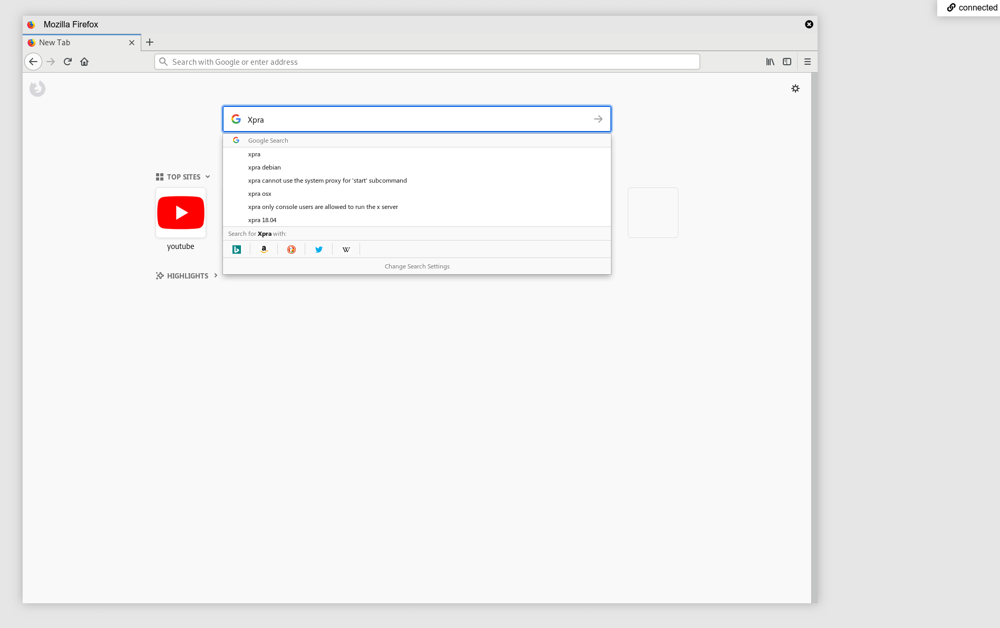

# Xpra HTML Client

This is an (unofficial) clone of the [Xpra HTML5 client](https://xpra.org/trac/browser/xpra/trunk/src/html5/).

It consists of a library and a frontend to connect to remote [Xpra](https://xpra.org/) servers to view X11 sessions inside the browser.

**THIS IS NOT DONE. SEE [TODO](#todo) LIST BELOW**

The differences here are:

* ES6+
* Bundled
* Refactored
* Non-blocking (whenever possible)
* Separate client module
* Separate frontend example

You can try this yourself at https://andersevenrud.github.io/xpra-html5-client (you need to set up an Xpra server yourself).



## Dependencies

This code is compiled for browser support. Requires Node 8 or later to compile.

*Note:*
* This might not compile on Windows.
* Note, you have set up your own Xpra server to connect to.

### Xpra

To be able to use the Xpra HTML5 features, you need the following dependencies on your host system:

* X11
* pam
* dbus
* alsa
* pulseaudio
* python

## Installation

If you want to run this on your server with a frontend. Clone this repository and perform the following commands:

First set up some dependencies:
```
git submodule init
git submodule update
cd lib/aurora.js
npm install
make browser
```

Then proceed with building:
```bash
npm install
npm run serve
```

This will build and start the `example/` application.

Runs by default on http://localhost:9999/

## Usage

If you're using this as a library:

```bash
npm install --save-dev xpra-html5-client
```

Then in your source:

```javascript
import {createClient} from 'xpra-html5-client';

const client = createClient({/* Configuration */});

client.on('ws:open', () => console.log('Connected!'));

client.connect({
  // This is the same as configuration in createClient()
  // Ex. You can specify your defaults above and pass on any options you want to set in the login form here
  uri: 'ws://localhost:10000'
});
```

See `example/` for an example (which can be served with the installation below).

### Configuration

#### Basic

| Name                     | Type           | Default Value                          | Description                                 |
| ------------------------ | -------------- | -------------------------------------- | ------------------------------------------- |
| `uri`                    | `String`       | `ws://localhost:10000`                 | Full URI for server websocket connection    |
| `reconnect`              | `Boolean`      | `true`                                 | Enable reconnection attempts                |
| `notifications`          | `Boolean`      | `true`                                 | Enable notification support                 |
| `clipboard`              | `Boolean`      | `false`                                | Enable clipboard support (**not supported**)|
| `sound`                  | `Boolean`      | `true`                                 | Enable sound support                        |
| `bell`                   | `Boolean`      | `true`                                 | Enable system bell                          |
| `printing`               | `Boolean`      | `false`                                | Enable printing support                     |
| `transfer`               | `Boolean`      | `false`                                | Enable file transfer support                |
| `keyboard`               | `Boolean`      | `true`                                 | Enable keyboard support                     |
| `share`                  | `Boolean`      | `true`                                 | Share session (multiple connections)        |
| `steal`                  | `Boolean`      | `true`                                 | Steal session on create                     |
| `language`               | `String`       | Auto                                   | Language (keyboard)                         |
| `username`               | `String`       |                                        | Username                                    |

#### Advanced

| Name                     | Type           | Default Value                          | Description                                 |
| ------------------------ | -------------- | -------------------------------------- | ------------------------------------------- |
| `dpi`                    | `Number`       | Auto                                   | Screen DPI                                  |
| `screen`                 | `Number[2]`    | Audo                                   | Screen size                                 |
| `audio_framework`        | `String`       | Auto                                   | Audio framework (stream/mediasource/aurora) |
| `audio_codec_blacklist`  | `String[]`     | `[]`                                   | Blacklist audio codecs                      |
| `audio_codecs`           | `String[]`     | Auto                                   | Force a set of audio codecs                 |
| `image_codecs`           | `String[]`     | Auto                                   | Force a set of image codecs                 |
| `compression_level`      | `Number`       | `1`                                    | Compression level (1-10)                    |
| `zlib`                   | `Boolean`      | `true`                                 | Use Zlib compression                        |
| `lz4`                    | `Boolean`      | `true`                                 | Use LZ4 compression                         |

### API

These are the methods exposed by the created client.

| Method                                   | Description                     |
| ---------------------------------------- | ------------------------------- |
| `connect()`                              | Connects to Xpra                |
| `disconnect()`                           | Disconnects from Xpra           |
| `ping()`                                 | Pings the server                |
| `send(...packet)`                        | Sends a packet to server        |
| `inject(ev wid?)`                        | Injects an event to a surface   |
| `on(name, callback)`                     | Register an event handler       |
| `off(name, callback)`                    | Unregister an event handler     |
| `surface.focus(wid)`                     | Focuses (raises) a surface      |
| `surface.kill(wid)`                      | Kills a surface                 |
| `screen.resize(w, h)`                    | Resizes the screen on remote    |
| `console.log(...)`                       | Sends a log message             |
| `console.info(...)`                      | Sends a info message            |
| `console.debug(...)`                     | Sends a debug message           |
| `console.warn(...)`                      | Sends a warn message            |
| `console.error(...)`                     | Sends a error message           |

#### Events

You can handle the events in the bus using the `.on()` API method.

> `*` is the event names coming from the Xpra packets. See official documentation for more information.

| Signature                               | Description                   |
| --------------------------------------- | ----------------------------- |
| `ws:open => (ev)`                       | Connection opened             |
| `ws:close => (ev)`                      | Connection closed             |
| `ws:data => (ev, data)`                 | Data received                 |
| `system:started => ()`                  | Startup complete              |
| `system:bell => ()`                     | System bell                   |
| `system:url => (url)`                   | URL Open request              |
| `system:upload => (options, data)`      | File was sent to client       |
| `system:print => (options, data)`       | Print was sent to client      |
| `window:create => (<surface>)`          | Window surface created        |
| `window:metadata => (<surface>)`        | Window metadata changed       |
| `window:icon => ({wid, src})`           | Window icon changed           |
| `window:destroy => (<surface>)`         | Window destroyed              |
| `window:focus => (<surface>)`           | Window focused (raised)       |
| `window:blur => (<surface>)`            | Window blured                 |
| `overlay:create => (<surface>)`         | Overlay surface created       |
| `overlay:destroy => (<surface>)`        | Overlay destroyed             |
| `notification:create => (id, options)`  | Notification create request   |
| `notification:destroy => (id)`          | Notification destroy request  |
| `*`                                     | Raw Xpra packet events        |

## Notes

The library is compiled as as UMD, so you can use this directly in the browser using a CDN or loading the `build/` file(s), then use the global `window.XpraHtml5Client` to access the APIs.

To launch an application in Xpra, use this as an example:

```bash
xpra --no-daemon --bind-tcp=127.0.0.1:10000 --start=firefox --html=on start :10
```

*If you want to be able to connect externally use `--bind-tcp=0.0.0.0:10000`*

## Working Features

* Connection
* WebWorker packet handler
* Image decoders (jpeg/png/rgb/rgb32)
* Sound decoders (stream/mediasource/aurora)
* Compression (lz4/zlib)
* Surfaces (window/overlay)
* Mouse input
* Keyboard input
* Sound output
* System bell
* Notification forwarding
* Window handling
* Server console

## TODO

* Fix authentication (not working in main code either)
* Full desktop forwarding
* SSL Support
* Print forwarding
* File forwarding
* Clipboard forwarding
* Window move/resize (incl. server side)
* Finish input support
* Finish platform capability detection
* Experimental video codec renderers

## License

*For third party licenses, see the dependencies in package.json and their sources*

MIT
